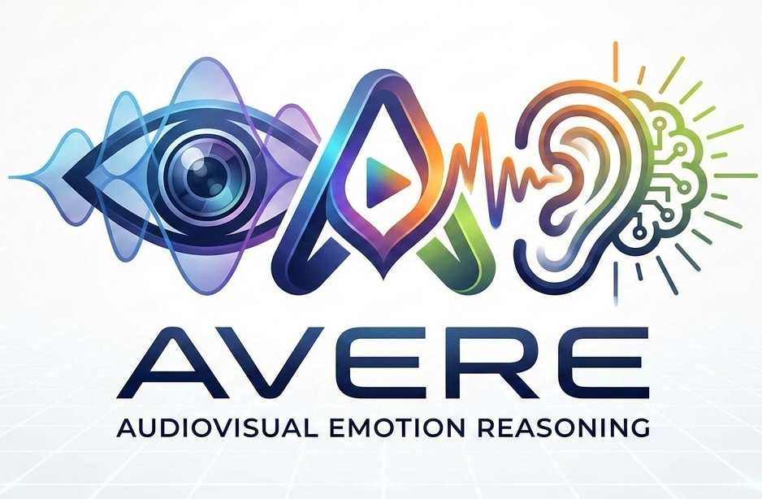

<div align="center">
  

  <h1>AVERE: Improving Audiovisual Emotion Reasoning with Preference Optimization</h1>
  <h3>ICLR 2026</h3>

  <p>
    <a href="https://arxiv.org/abs/2602.07054">
      
    </a>
    <a href="https://openreview.net/forum?id=td682AAuPr">
      
    </a>
    <a href="https://github.com/ihp-lab/AVERE">
      
    </a>
    <a href="https://avere-iclr.github.io/">
      
    </a>
    <a href="https://huggingface.co/chaubeyG/AVERE-7B">
      
    </a>
    <a href="https://huggingface.co/datasets/chaubeyG/EmoReAlM">
      
    </a>
    <a href="LICENSE.rst">
      
    </a>
    <a href="https://www.python.org/">
      
    </a>
    
  </p>
  <br>
</div>

This is the official codebase of the **ICLR 2026** paper - AVERE: Improving Audiovisual Emotion Reasoning with Preference Optimization. 

---

## 🧾 Abstract

Emotion understanding is essential for building socially intelligent agents. Although recent multimodal large language models (MLLMs) have shown strong performance on this task, two key challenges remain: (i) spurious associations between emotions and irrelevant audiovisual cues (reasoning errors) and (ii) hallucination of audiovisual cues (perception errors) driven by text priors in the language model backbone. To quantify and understand these issues, we introduce EmoReAlM, a benchmark designed to evaluate MLLMs for cue–emotion associations, hallucinations, and modality agreement. We then propose AVEm-DPO, a preference optimization technique that aligns model responses with both audiovisual inputs and emotion-centric queries. Specifically, we construct preferences over (i) responses exhibiting spurious associations or hallucinations and (ii) audiovisual input pairs guided by textual prompts. We also include a regularization term that penalizes reliance on text priors, thereby mitigating modality-specific cue hallucinations. Experimental results on DFEW, RAVDESS, and EMER demonstrate that our method significantly improves the performance of the reference baseline models (6-19% of relative performance) in zero-shot settings. By providing both a rigorous benchmark and a robust optimization framework, this work enables principled evaluation and improvement of MLLMs for emotion understanding and social AI.

---

## 📣 News

- [Mar. 2026] Codebase for AVERE is public now. We are releasing the codebase in parts, and the initial release consists of evaluation scripts for EmoReAlM benchmark as well as other emotion benchmarks. Expect training code to be released very soon.
- [Mar. 2026] Please find the weights for AVERE on 🤗 HuggingFace at [chaubeyG/AVERE-7B](https://huggingface.co/chaubeyG/AVERE-7B). We sincerely apologize for the delay in the release of checkpoints. Go crazy with it.
- [Jan. 2026] We released the EmoReAlM benchmark proposed in our [paper](https://arxiv.org/abs/2602.07054) on HuggingFace at [chaubeyG/EmoReAlM](https://huggingface.co/datasets/chaubeyG/EmoReAlM). 
- [Jan. 2026] AVERE accepted to ICLR 2026. See you in Rio de Janeiro!

## 🏆 Results

Please find the detailed results and Leaderboard for EmoReAlM benchmark at our project website - [avere-iclr.github.io](https://avere-iclr.github.io/). If you want to include your model in the EmoReAlM benchmark, please email the author at [achaubey@usc.edu](mailto::achaubey@usc.edu).

## 📦 Repository Structure

```bash
├── avere/                 # Main source code for AVERE
├── backbones/             # Folder to download backbone models such as LanguageBind Encoders, Whisper Encoder and BERT-base-uncased model. See Inference step-1 below.
├────── bert-base-uncased
├────── LanguageBind_Image
├────── LanguageBind_Video_merge
├────── whisper-large-v3
├── checkpoint/            # Folder to store the main model weights of AVERE
├── data_preprocess/       # Data preprocessing code base which preprocesses data and generates training data
├── evaluate/              # Evaluation codebase to compute metrics 
├── scripts/               # Training scripts for Face-LLaVA
```

---

## 🔧 Installation

1. **Clone the repository**
    ```bash
    git clone https://github.com/ihp-lab/AVERE.git
    cd AVERE
    ```

2. **Create a virtual environment** (recommended)
    ```bash
    conda create -n avere python=3.10 -y
    conda activate avere
    ```

3. **Install torch**
    ```bash
    pip install torch==2.5.1 torchvision torchaudio --index-url https://download.pytorch.org/whl/cu121
    ```

    <details>
    <summary>Potential issues</summary>

    - You might want to download PyTorch for a different version of CUDA. We download it for CUDA-12.1 but we have tested it on a machine with CUDA-12.2 as well. However, you might need to change this depending on your machine.
    - Based on the above, you might also have to upgrade/downgrade torch. 
    
    </details>
    

4. **Install in editable mode for development**:
    ```bash
    pip install -e .
    pip install -e ".[train]" ## if you want to train your own model
    ```

5. **Install other libraries**:
    ```bash
    pip install flash-attn --no-build-isolation ## recommended but not required
    pip install decord soundfile opencv-python git+https://github.com/facebookresearch/pytorchvideo.git@28fe037d212663c6a24f373b94cc5d478c8c1a1d
    ```


---

## 🎯 Inference

1. Download [LanguageBind_Image](https://huggingface.co/LanguageBind/LanguageBind_Image), [LanguageBind_Video_merge](https://huggingface.co/LanguageBind/LanguageBind_Video_merge), [bert-base-uncased](https://huggingface.co/google-bert/bert-base-uncased), and [whisper-large-v3](https://huggingface.co/openai/whisper-large-v3) inside the folder `backbones/`.

2. Download the model weights from [huggingface](https://huggingface.co/chaubeyG/AVERE-7B) inside `checkpoint/` folder so that the structure becomes - `./checkpoint/AVERE-7B`.

3. Run the following script to perform single video inference

    ```bash
    CUDA_VISIBLE_DEVICES=0 python infer.py \
        --video_path "/path/to/input.mp4" \
        --prompt "Describe the emotion of the person in the video in detail."
    ```

    Use the `--no_audio` flag in the script to run inference using only the video.

## Evaluation

1. Perform steps 1. and 2. of the Inference above to download the weights of backbones and AVERE.

2. Create a parent data directory for downloading the datasets and update the `VIDEO_EVAL_DATA_PAR` inside `evaluate/eval_constants.py` to this path.

3. Download EmoReAlM dataset from HuggingFace at [chaubeyG/EmoReAlM](https://huggingface.co/datasets/chaubeyG/EmoReAlM). Place it inside your parent data directory.

4. Download the DFEW dataset from its [official website](https://dfew-dataset.github.io/). You also need to process the videos in DFEW to 24 FPS and the audios to 16KHz. 

5. [Optional] Download the speech part of the RAVDESS dataset from [Zenodo](https://zenodo.org/records/1188976) and process and organize it as shown in the following point. This is only required if you want to run evaluation on RAVDESS.

6. The data directory should look like the following after the downloads.

    <details>
    <summary> Data directory structure </summary>

    ``` bash
    EmoReAlM/                                  # EmoReAlM benchmark (HuggingFace)
    └── emorealm_v1.json

    dfew/                                      # DFEW dataset (processed)
    ├── dfew_annotation/
    │   └── test(single-labeled)/
    │       └── set_1.csv                      # Original set-1 test set
    ├── dfew_original_clips_24fps/
    │   ├── part_1/
    │   │   └── 1.mp4                          # Video converted to 24fps
    │   ├── ...
    │   └── part_11/
    └── dfew_original_clips_16khz/
        ├── part_1/
        │   └── 1.wav                          # 16kHz mono PCM 16-LE
        ├── ...
        └── part_11/

    RAVDESS/                                   # RAVDESS dataset (processed) (Required only if you want to run evaluation on RAVDESS) 
    ├── ravdess_videos_24fps/
    │   ├── Actor_01/
    │   │   └── 01-01-01-01-01-01-01.mp4       # Video converted to 24fps
    │   ├── ...
    │   └── Actor_24/
    └── ravdess_videos_16khz/
        ├── Actor_01/
        │   └── 01-01-01-01-01-01-01.wav       # 16kHz mono PCM 16-LE
        ├── ...
        └── Actor_24/
    ```
    </details>

7. Run the evaluation script as following

    ```bash
    CUDA_VISIBLE_DEVICES=0 python evaluate/main.py \
        --model_path "checkpoint/AVERE-7B" \
        --task "emotion_qa-emorealm" # tasks can be emotion_qa-emorealm, emotion-dfew-audio, and emotion-ravdess-video-audio
        --batch_size 1 # always use batch size of 1 for EmoReAlM and larger batch sizes for DFEW and RAVDESS. We use 8 batch size using H100.
    ```

    In case you have more than 1 GPUs available for inference, please use the following script to launch inference on multiple GPUs.

    ```bash
    bash scripts/eval.sh \
        --gpus 2,4,6 \ # specify the physical GPU IDs here
        --task emotion_qa-emorealm # tasks can be emotion_qa-emorealm, emotion-dfew-audio, and emotion-ravdess-video-audio
        --batch 1 # always use batch size of 1 for EmoReAlM and larger batch sizes for DFEW and RAVDESS. We use 8 batch size using H100.
    ```

8. Model responses and metrics are saved inside `eval_temp/{task_name}/AVERE-7B`. After performing the evaluation above, you should see number very close to those reported for *"Our Base + AVEm-DPO"* in the paper.

### ✅ Repository Progress

- [ ] Training data and instruction
- [ ] Training code and instructions
- [x] Training Script
- [x] Evaluation Code
- [x] Inference Code
- [x] Model Weights 
- [x] Benchmark Release

## ⚖️ License

This codebase is distributed under the USC Research license. See [LICENSE.rst](LICENSE.rst) for more details. This repo uses parts of code from the [Face-LLaVA](https://github.com/ihp-lab/Face-LLaVA/) and [VideoLLaVA](https://github.com/PKU-YuanGroup/Video-LLaVA) repositories and our codebase inherit their license for those.

## 🙌 Credits

This codebase builds upon the following excellent works: [VideoLLaVA](https://github.com/PKU-YuanGroup/Video-LLaVA), [LLaVA](https://github.com/haotian-liu/LLaVA) and [LLaVA-Next](https://github.com/LLaVA-VL/LLaVA-NeXT). We gratefully acknowledge their contributions to the open-source community.

## 🪶 Citation

```latex
@inproceedings{
chaubey2026avere,
title={{AVERE}: Improving Audiovisual Emotion Reasoning with Preference Optimization},
author={Ashutosh Chaubey and Jiacheng Pang and Maksim Siniukov and Mohammad Soleymani},
booktitle={The Fourteenth International Conference on Learning Representations},
year={2026},
url={https://openreview.net/forum?id=td682AAuPr}
}
```
